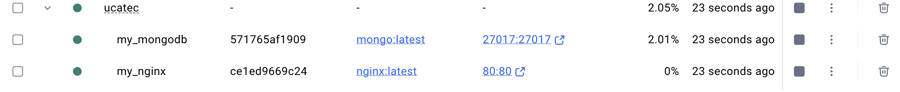
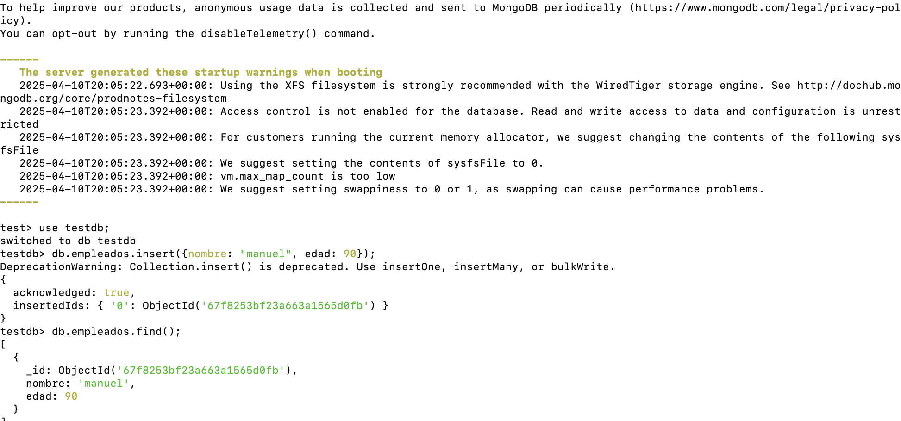
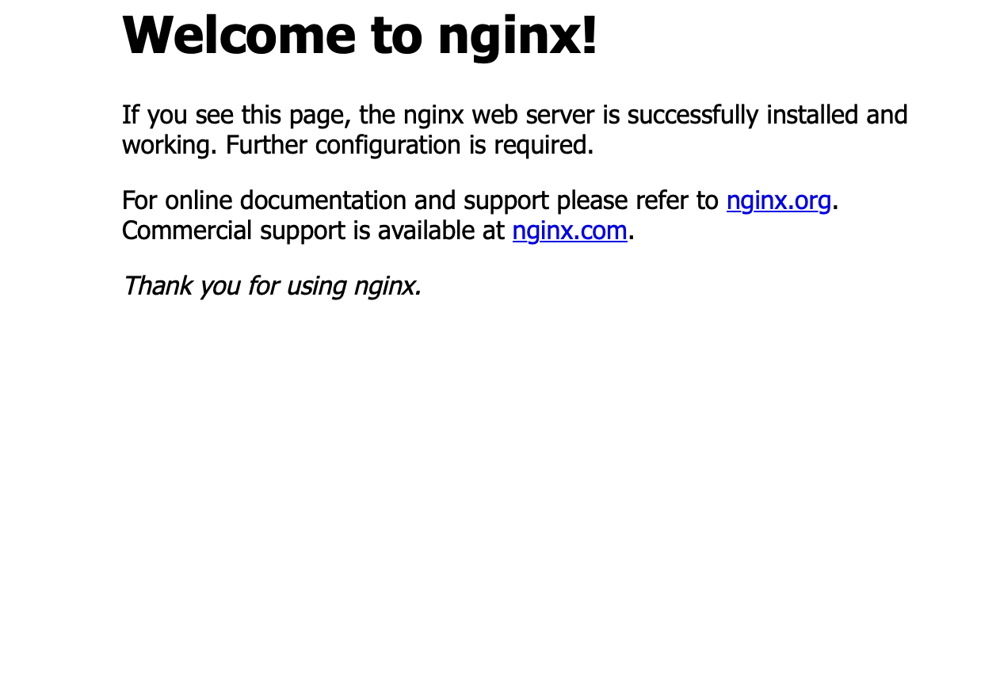

# Examen Parcial - RinaldoLino

Este proyecto configura tres servicios usando **Docker Compose**:

- PostgreSQL, MongoDB, NGINX

También se documenta cómo probar estos servicios creando una **tabla** en PostgreSQL y una **colección** en MongoDB.

---


## ⚙️ Paso 1: Crear Rama

```bash
git clone https://github.com/Rinaldito/UCatec.git
cd UCatec
git checkout -b ExamenParcial/RinaldoLino
```

---

## 📄 Paso 2: Crear Archivos y Carpeta

```bash
touch README.md
touch docker-compose.yml
mkdir images
```

---

## 🐳 Paso 3: Contenido de `docker-compose.yml`

```yaml
version: '3.8'

services:
  postgres:
    image: postgres:latest
    container_name: my_postgres
    environment:
      POSTGRES_USER: Examen
      POSTGRES_PASSWORD: 123456
      POSTGRES_DB: testdb
    ports:
      - "5432:5432"
    volumes:
      - pgdata:/var/lib/postgresql/data

  mongodb:
    image: mongo:latest
    container_name: my_mongodb
    ports:
      - "27017:27017"
    volumes:
      - mongo_data:/data/db

  nginx:
    image: nginx:latest
    container_name: my_nginx
    ports:
      - "80:80"

volumes:
  pgdata:
  mongo_data:
```

---

## ▶️ Paso 4: Levantar Servicios

```bash
docker-compose up -d
```

Verificar contenedores:

```bash
docker ps
```

**Captura:**  


---


---

## Paso 5: Probar PostgreSQL

1. Ingresar al contenedor:

```bash
docker exec -it my_postgres psql -U Examen -d testdb
```

2. Ejecutar comandos SQL:

```sql
CREATE TABLE personas (
  id SERIAL PRIMARY KEY,
  nombre VARCHAR(100),
  edad INT
);

INSERT INTO personas (nombre, edad) VALUES
  ('Kely', 50),
  ('Julia', 33);

SELECT * FROM personas;
```

**Captura:**  


---

## Paso 6: Probar MongoDB

1. Ingresar al contenedor:

```bash
docker exec -it my_mongodb mongosh
```

2. Ejecutar comandos MongoDB:

```js
use testdb;

db.empleados.insert({nombre: "manuel", edad: 90});

db.empleados.find();
```

**Captura de pantalla:**  


---

##  Paso 7: Probar NGINX

El servicio NGINX se levantó correctamente utilizando la imagen oficial de Docker.

### 🔍 Verificar acceso al servidor

1. Abre tu navegador y entra a:

```js 
http://localhost
```


2. Deberías ver la **página por defecto de NGINX**, similar a la siguiente:

**Captura de pantalla del navegador con NGINX:**



---

## Conclusión

Los tres servicios fueron configurados exitosamente con Docker.
Se comprobó su funcionamiento mediante la inserción de datos en una tabla de PostgreSQL y en una colección de MongoDB.
La documentación presenta capturas reales que evidencian todo el procedimiento.

---

##  Commit y Push Final

```bash
git add .
git commit -m "Subida completa del parcial"
git push origin ExamenParcial/RinaldoLino

```

---